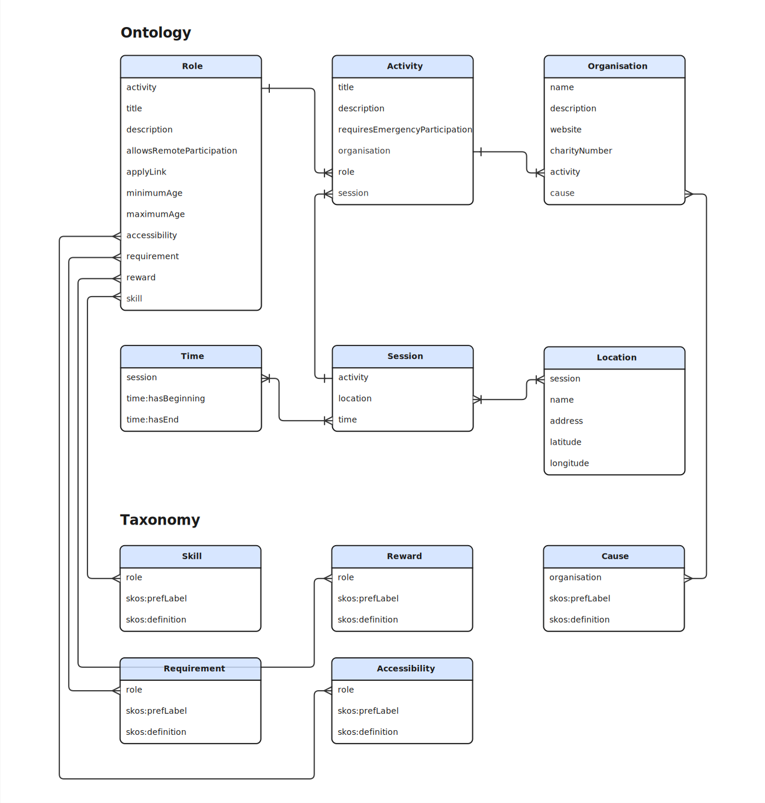

<nav id="toc" class="toc">
<h2 id="table-of-contents">Table of Contents</h2>
<ol>
  <li><a href="#introduction">1. Introduction</a></li>
  <li><a href="#volunteering-data-model">2. Volunteering Data Model</a>
    <ol>
      <li><a href="#organisation">2.1 Organisation</a>
        <ol>
          <li><a href="#organisation-properties">2.1.1 Properties</a></li>
          <li><a href="#organisation-example">2.1.2 Example</a></li>
        </ol>
      </li>
      <li><a href="#activity">2.2 Activity</a>
        <ol>
          <li><a href="#activity-properties">2.2.1 Properties</a></li>
          <li><a href="#activity-example">2.2.2 Example</a></li>
        </ol>
      </li>
      <li><a href="#role">2.3 Role</a>
        <ol>
          <li><a href="#role-properties">2.3.1 Properties</a></li>
          <li><a href="#role-example">2.3.2 Example</a></li>
        </ol>
      </li>
      <li><a href="#session">2.4 Session</a>
        <ol>
          <li><a href="#session-properties">2.4.1 Properties</a></li>
          <li><a href="#session-example">2.4.2 Example</a></li>
        </ol>
      </li>
      <li><a href="#location">2.5 Location</a>
        <ol>
          <li><a href="#location-properties">2.5.1 Properties</a></li>
          <li><a href="#location-example">2.5.2 Example</a></li>
        </ol>
      </li>
      <li><a href="#time">2.6 Time</a>
        <ol>
          <li><a href="#time-properties">2.6.1 Properties</a></li>
          <li><a href="#time-defined-temporal-entities">2.6.2 Defined temporal entities</a></li>
          <li><a href="#time-example">2.6.3 Example</a></li>
        </ol>
      </li>
    </ol>
  </li>
  <li><a href="#taxonomies">3. Taxonomies</a></li>
  <li><a href="#sharing-opportunities-data">4. Sharing Opportunities Data</a></li>
  <li><a href="#ai-readiness">5. AI Readiness</a></li>
  <li><a href="#contributing-knowledge">6. Contributing Knowledge</a>
    <ol>
      <li><a href="#discussion-topics">6.1 Discussion Topics</a></li>
    </ol>
  </li>
  <li><a href="#standardisation-history">7. Standardisation History</a></li>
</ol>
</nav>

<h2 id="introduction">1. Introduction</h2>

The volunteering and social action ontology can be <a href="../webvowl/#opts=doc=0;filter_sco=true;mode_compact=true">visualized through WebVOWL</a>, a web-based ontology visualization tool.

The volunteering and social action ontology is implemented using RDF, a native data format for the semantic web. RDF enables the <a href="https://5stardata.info/en/">5-star</a> deployment scheme for Open Data; a scheme suggested by Tim Berners-Lee, the inventor of the Web and <a href="https://www.w3.org/DesignIssues/LinkedData.html">Linked Data</a> initiator.

<h2 id="volunteering-data-model">2. Volunteering Data Model</h2>

The following diagram illustrates the main elements of the Volunteering and Social Action Ontology.

<h3 id="organisation">2.1 Organisation</h3>

Any organisation running activities that involve volunteers.

<h4 id="organisation-properties">2.1.1 Properties</h4>

<dl>
  <dt id="organisation-name">name</dt>
  <dd>The organisation's name.</dd>
  <dt id="organisation-description">description</dt>
  <dd>A description of the organisation.</dd>
  <dt id="organisation-website">website</dt>
  <dd>The URL of the organisation's website.</dd>
  <dt id="organisation-image">image</dt>
  <dd>An image representing the organisation (e.g. logo or photo).</dd>
  <dt id="organisation-activity">activity</dt>
  <dd>A volunteering opportunity offered by the organisation.</dd>
  <dt id="organisation-cause">cause</dt>
  <dd>A charitable cause the organisation is involved with. See the <a href="./cause">Charitable Cause Taxonomy</a>.</dd>
  <dt id="organisation-charity-number">charityRegistration</dt>
  <dd>The charity registration number and registrar. See also UK charity registration authorities:
    <a href="https://www.charitycommissionni.org.uk/">The Charity Commission for Northern Ireland</a>;
    <a href="https://www.oscr.org.uk/about-charities/">Office of the Scottish Charity Regulator (OSCR)</a>;
    <a href="https://register-of-charities.charitycommission.gov.uk/">Charity Commission for England and Wales</a>.
    <dl>
      <dt id="charity-registration-registrar">registrar</dt>
      <dd>The charity registration authority.</dd>
      <dt id="charity-registration-registration-number">registrationNumber</dt>
      <dd>The charity registration number.</dd>
    </dl>
  </dd>
</dl>

<h4 id="organisation-example">2.1.2 Example</h4>

  <h5 id="example-1">Example 1</h5>


{
  "@context": "https://api.volunteeringdata.io/context/v1",
  "type": "Organisation",
  "id": "https://example.org/organisation/oxfam-gb",
  "name": "Oxfam",
  "description": "Oxfam is a global movement of people working together to end the injustice of poverty.",
  "website": "https://www.oxfam.org.uk/",
  "charityNumber": "202918",
  "image": "https://example.org/images/oxfam-logo.png",
  "cause": [
    "https://ns.volunteeringdata.io/AntiPoverty",
    "https://ns.volunteeringdata.io/CivilRights"
  ],
  "activity": [
    ... (see activity example)
  ],
  "charityRegistration": [
    {
      "registrar": "https://register-of-charities.charitycommission.gov.uk",
      "registrationNumber": "202918"
    },
    {
      "registrar": "https://www.oscr.org.uk",
      "registrationNumber": "SC039042"
    },
    {
      "registrar": "https://www.charitycommissionni.org.uk",
      "registrationNumber": "100848"
    }
  ]
}


  <h5 id="note-1">Note 1</h5>
  
One charity can register with multiple charity number registries.

  
For example, Oxfam is registered with:

  <ul>
    <li>The Charity commission for England and Wales as <a href="https://register-of-charities.charitycommission.gov.uk/en/charity-search/-/charity-details/202918">202918</a></li>
    <li>The OSCR as <a href="https://www.oscr.org.uk/about-charities/search-the-register/charity-details?number=SC039042">SC039042</a></li>
    <li>The Charity commission for Northern Ireland as <a href="https://www.charitycommissionni.org.uk/charity-search/charity-details-page/?regId=100848&subId=0">100848</a></li>
  </ul>

<h3 id="activity">2.2 Activity</h3>

Any kind of activity that involves volunteers.

<h4 id="activity-properties">2.2.1 Properties</h4>

<dl>
  <dt id="activity-title">title</dt>
  <dd>The activity's title.</dd>
  <dt id="activity-description">description</dt>
  <dd>A description of the activity.</dd>
  <dt id="activity-requires-emergency-participation">requiresEmergencyParticipation</dt>
  <dd>Whether the activity requires emergency participation (boolean).</dd>
  <dt id="activity-image">image</dt>
  <dd>An image representing the activity.</dd>
  <dt id="activity-image">publishStart</dt>
  <dd>The date at which publication of the activity must start.</dd>
  <dt id="activity-image">publishEnd</dt>
  <dd>The date at which publication of the activity must end.</dd>
  <dt id="activity-organisation">organisation</dt>
  <dd>The organisation running the activity.</dd>
  <dt id="activity-role">role</dt>
  <dd>A volunteer role associated with the activity.</dd>
  <dt id="activity-session">session</dt>
  <dd>A session when the activity takes place.</dd>
</dl>

<h4 id="activity-example">2.2.2 Example</h4>

  <h5 id="example-2">Example 2</h5>
  <pre class="hljs json">{
  "@context": "https://api.volunteeringdata.io/context/v1",
  "id": "https://id.volunteeringdata.io/686e542f7734eb69b0ec1516",
  "type": "Activity",
  "title": "Volunteer Skywalker",
  "description": "Help distribute food, drink, and much-needed essential supplies to those who don't have a safe place to call home.",
  "publishEnd": "2026-08-28",
  "organisation": "https://id.volunteeringdata.io/684059665d271835a2253c9d",
  "role": {
    "applyLink": "https://underoneskytogether.com/get-involved/join-us",
    "minimumAge": "16"
  },
  "session": {
    "location": [
      {
        "address": "127-128 Lower Marsh, London SE1 7AE, UK",
        "latitude": "51.5005014",
        "longitude": "-0.1136474"
      }
    ],
    "time": [
      "volunteering:MondayAfternoon",
      "volunteering:TuesdayAfternoon",
      "volunteering:SaturdayMorning",
      "https://ns.volunteeringdata.io/SaturdayAfternoon"
    ]
  }
}</pre>

  <h5 id="note-2">Note 2</h5>
  
In example 2, the organisation is referred to through its identifier. It is also possible to embed the organisation details in the activity representation.

  
Standard-defined <a href="#time-defined-temporal-entities">temporal entities</a> can be referred to via their <a href="https://en.wikipedia.org/wiki/CURIE">compact URI</a> (using the "volunteering" prefix). That is: "volunteering:TuesdayMorning" is equivalent to "https://ns.volunteeringdata.io/TuesdayMorning".

  
New temporal entities can be defined using the <a href="https://www.w3.org/TR/owl-time/">Time ontology in OWL</a>. See for example <a href="https://api.volunteeringdata.io/describe.ttl?id=https://ns.volunteeringdata.io/TuesdayMorning">Tuesday Morning</a>.

  
While URLs are preferable for identifiers because the data is then authoritative and can be <a href="https://www.w3.org/wiki/LinkedData">dereferenced</a> at source, <a href="https://www.ietf.org/rfc/rfc4122.txt">urn:uuid:</a> identifiers can be used too.

<h3 id="role">2.3 Role</h3>

Any kind of role related to a volunteering activity.

<h4 id="role-properties">2.3.1 Properties</h4>

<dl>
  <dt id="role-title">title</dt>
  <dd>The role's title.</dd>
  <dt id="role-description">description</dt>
  <dd>A description of the role.</dd>
  <dt id="role-commitment">commitment</dt>
  <dd>The time commitment expected for the role.</dd>
  <dt id="role-apply-link">applyLink</dt>
  <dd>A link to apply for the role.</dd>
  <dt id="role-allows-remote-participation">allowsRemoteParticipation</dt>
  <dd>Whether the role allows remote participation (boolean).</dd>
  <dt id="role-minimum-age">minimumAge</dt>
  <dd>The minimum age requirement for the role.</dd>
  <dt id="role-maximum-age">maximumAge</dt>
  <dd>The maximum age requirement for the role.</dd>
  <dt id="role-activity">activity</dt>
  <dd>The activity this role is part of.</dd>
  <dt id="role-accessibility">accessibility</dt>
  <dd>Accessibility information for the role.</dd>
  <dt id="role-requirement">requirement</dt>
  <dd>A requirement for the role. See the <a href="./requirement">Requirement Taxonomy</a>.</dd>
  <dt id="role-reward">reward</dt>
  <dd>A reward associated with the role.</dd>
  <dt id="role-skill">skill</dt>
  <dd>A skill associated with the role. See the <a href="./skill">Skill Taxonomy</a>.</dd>
</dl>

<h4 id="role-example">2.3.2 Example</h4>

  <h5 id="example-3">Example 3</h5>
  <pre class="hljs json">{
  "@context": "https://api.volunteeringdata.io/context/v1",
  "type": "Role",
  "id": "https://example.org/role/outreach-volunteer",
  "title": "Outreach Volunteer",
  "description": "Walk set routes to engage with people sleeping rough, offering food, warm clothing, and signposting to support services.",
  "commitment": "One evening per week, 3-hour shift",
  "applyLink": "https://underoneskytogether.com/get-involved/join-us",
  "allowsRemoteParticipation": false,
  "minimumAge": "18",
  "activity": "https://id.volunteeringdata.io/686e542f7734eb69b0ec1516",
  "requirement": [
    "https://ns.volunteeringdata.io/DBSCheck"
  ],
  "reward": [
    "https://ns.volunteeringdata.io/TrainingProvided",
    "https://ns.volunteeringdata.io/ExpensesReimbursed"
  ],
  "skill": [
    "https://ns.volunteeringdata.io/Communication",
    "https://ns.volunteeringdata.io/EmpathyAndCompassion"
  ]
}</pre>

<h3 id="session">2.4 Session</h3>

A session describes a time and place for an activity that involves volunteers.

<h4 id="session-properties">2.4.1 Properties</h4>

<dl>
  <dt id="session-activity">activity</dt>
  <dd>The activity this session is for.</dd>
  <dt id="session-location">location</dt>
  <dd>The location where the session takes place.</dd>
  <dt id="session-time">time</dt>
  <dd>The time when the session occurs.</dd>
</dl>

<h4 id="session-example">2.4.2 Example</h4>

  <h5 id="example-4">Example 4</h5>
  <pre class="hljs json">{
  "@context": "https://api.volunteeringdata.io/context/v1",
  "type": "Session",
  "activity": "https://id.volunteeringdata.io/686e542f7734eb69b0ec1516",
  "location": {
    "name": "Under One Sky Hub",
    "address": "127-128 Lower Marsh, London SE1 7AE, UK",
    "latitude": "51.5005014",
    "longitude": "-0.1136474"
  },
  "time": "https://ns.volunteeringdata.io/MondayAfternoon"
}</pre>

  <h5 id="note-3">Note 3</h5>
  
Sessions typically do not have an <code>id</code> attribute of their own, as they will generally be presented embedded within the context of an activity (see <a href="#activity-example">Example 2</a>).

<h3 id="location">2.5 Location</h3>

Any location related to volunteering activities.

<h4 id="location-properties">2.5.1 Properties</h4>

<dl>
  <dt id="location-name">name</dt>
  <dd>A name for the location.</dd>
  <dt id="location-address">address</dt>
  <dd>The location's address as free text. This can be a partial (e.g. postcode) or full address.</dd>
  <dt id="location-geometry">geometry</dt>
  <dd>A generic geometry object to support interfaces common to all geographically referenced geometric objects. Sub-property of <a href="https://docs.ogc.org/is/22-047r1/22-047r1.html#_property_geohasgeometry">geosparql:hasGeometry</a>. See the <a href="https://docs.ogc.org/is/22-047r1/22-047r1.html">GeoSPARQL standard</a>.</dd>
  <dt id="location-latitude">latitude</dt>
  <dd>The location's latitude in decimal degree. Sub-property of <a href="http://www.w3.org/2003/01/geo/wgs84_pos#lat">geo:lat</a>. See <a href="https://www.w3.org/2003/01/geo/wgs84_pos">WGS84 Geo Positioning</a>.</dd>
  <dt id="location-longitude">longitude</dt>
  <dd>The location's longitude in decimal degree. Sub-property of <a href="http://www.w3.org/2003/01/geo/wgs84_pos#lat">geo:long</a>. See <a href="https://www.w3.org/2003/01/geo/wgs84_pos">WGS84 Geo Positioning</a>.</dd>
  <dt id="location-session">session</dt>
  <dd>A session that takes place at this location.</dd>
</dl>

<h4 id="location-example">2.5.2 Example</h4>

  <h5 id="example-5">Example 5</h5>
  <pre class="hljs json">{
  "@context": "https://api.volunteeringdata.io/context/v1",
  "type": "Location",
  "name": "Under One Sky Hub",
  "address": "127-128 Lower Marsh, London SE1 7AE, UK",
  "latitude": "51.5005014",
  "longitude": "-0.1136474"
}</pre>

  <h5 id="note-4">Note 4</h5>
  
Locations could be predefined and reused. For example, a council's boundary can be serialised as <a href="https://en.wikipedia.org/wiki/Well-known_text_representation_of_geometry">Well-Known Text (WKT)</a> and linked to via the <code>geometry</code> property. The <a href="https://docs.ogc.org/is/22-047r1/22-047r1.html">GeoSPARQL standard</a> defines how to link geometries to <a href="https://docs.ogc.org/is/22-047r1/22-047r1.html#C.1.1.2.2">WKT literals</a>. For an example of such a boundary, see the <a href="https://mapit.mysociety.org/area/2508.html">geometry of the Hackney Borough Council</a>.

  <h5 id="example-6">Example 6</h5>
  <pre class="hljs json">{
  "@context": "https://api.volunteeringdata.io/context/v1",
  "type": "Location",
  "name": "Aberdeen",
  "geometry": {
    "geosparql:asWKT": "MULTIPOLYGON (((385726.9995 815937.7998, 385745.5014 ... 395720.5 801236.85, 395721 801236.8, 395721.2 801236.6)))"
  }
}</pre>

<h3 id="time">2.6 Time</h3>

Any time information related to volunteering activities modeled as a OWL time temporal entity.

<h4 id="time-properties">2.6.1 Properties</h4>

<dl>
  <dt id="time-label">rdfs:label</dt>
  <dd>The temporal entity's name. See <a href="https://www.w3.org/TR/owl-time/#time:TemporalEntity">OWL Time Temporal Entity</a>.</dd>
  <dt id="time-beginning">time:hasBeginning</dt>
  <dd>The beginning of a period of time. See <a href="https://www.w3.org/TR/owl-time/#time:hasBeginning">OWL Time has beginning</a>.</dd>
  <dt id="time-end">time:hasEnd</dt>
  <dd>The end of a period of time. See <a href="https://www.w3.org/TR/owl-time/#time:hasEnd">OWL Time has end</a>.</dd>
</dl>

<h4 id="time-defined-temporal-entities">2.6.2 Defined temporal entities</h4>

<dl>
  <dt id="time-monday-morning">MondayMorning</dt>
  <dd>The time period between 6am and 12pm on Monday.</dd>
  <dt id="time-monday-afternoon">MondayAfternoon</dt>
  <dd>The time period between 12pm and 6pm on Monday.</dd>
  <dt id="time-monday-evening">MondayEvening</dt>
  <dd>The time period between 6pm and 12am on Monday.</dd>
  <dt id="time-tuesday-morning">TuesdayMorning</dt>
  <dd>The time period between 6am and 12pm on Tuesday.</dd>
  <dt id="time-tuesday-afternoon">TuesdayAfternoon</dt>
  <dd>The time period between 12pm and 6pm on Tuesday.</dd>
  <dt id="time-tuesday-evening">TuesdayEvening</dt>
  <dd>The time period between 6pm and 12am on Tuesday.</dd>
  <dt id="time-wednesday-morning">WednesdayMorning</dt>
  <dd>The time period between 6am and 12pm on Wednesday.</dd>
  <dt id="time-wednesday-afternoon">WednesdayAfternoon</dt>
  <dd>The time period between 12pm and 6pm on Wednesday.</dd>
  <dt id="time-wednesday-evening">WednesdayEvening</dt>
  <dd>The time period between 6pm and 12am on Wednesday.</dd>
  <dt id="time-thursday-morning">ThursdayMorning</dt>
  <dd>The time period between 6am and 12pm on Thursday.</dd>
  <dt id="time-thursday-afternoon">ThursdayAfternoon</dt>
  <dd>The time period between 12pm and 6pm on Thursday.</dd>
  <dt id="time-thursday-evening">ThursdayEvening</dt>
  <dd>The time period between 6pm and 12am on Thursday.</dd>
  <dt id="time-friday-morning">FridayMorning</dt>
  <dd>The time period between 6am and 12pm on Friday.</dd>
  <dt id="time-friday-afternoon">FridayAfternoon</dt>
  <dd>The time period between 12pm and 6pm on Friday.</dd>
  <dt id="time-friday-evening">FridayEvening</dt>
  <dd>The time period between 6pm and 12am on Friday.</dd>
  <dt id="time-saturday-morning">SaturdayMorning</dt>
  <dd>The time period between 6am and 12pm on Saturday.</dd>
  <dt id="time-saturday-afternoon">SaturdayAfternoon</dt>
  <dd>The time period between 12pm and 6pm on Saturday.</dd>
  <dt id="time-saturday-evening">SaturdayEvening</dt>
  <dd>The time period between 6pm and 12am on Saturday.</dd>
  <dt id="time-sunday-morning">SundayMorning</dt>
  <dd>The time period between 6am and 12pm on Sunday.</dd>
  <dt id="time-sunday-afternoon">SundayAfternoon</dt>
  <dd>The time period between 12pm and 6pm on Sunday.</dd>
  <dt id="time-sunday-evening">SundayEvening</dt>
  <dd>The time period between 6pm and 12am on Sunday.</dd>
</dl>

<h4 id="time-example">2.6.3 Example</h4>

  <h5 id="example-7">Example 7</h5>
  <pre class="hljs json">{
  "@context": "https://api.volunteeringdata.io/context/v1",
  "type": "Time",
  "rdfs:label": "Tuesday 2 to 4 pm",
  "time:hasBeginning": {
    "time:inDateTime": {
      "time:dayOfWeek": "time:Tuesday",
      "time:hour": 14
    }
  },
  "time:hasEnd": {
    "time:inDateTime": {
      "time:dayOfWeek": "time:Tuesday",
      "time:hour": 16
    }
  }
}</pre>

  <h5 id="note-5">Note 5</h5>
  
User research shows that volunteering opportunities generally have flexible schedules. The predefined <a href="#time-defined-temporal-entities">temporal entities</a> defined in section 2.6.2 should be reused where possible.

  
See for example the availability filter on <a href="https://volunteer.scot/search?keywords=clean&amp;location=&amp;lat=&amp;lon=&amp;display=list&amp;sort=relevance&amp;availability=monday-morning&amp;availability=wednesday-morning&amp;availability=tuesday-afternoon&amp;availability=wednesday-afternoon&amp;availability=friday-afternoon&amp;availability=saturday-afternoon&amp;availability=friday-evening">Volunteer Scotland's search</a>, which uses morning, afternoon, and evening slots per day of the week.

<h2 id="taxonomies">3. Taxonomies</h2>

<ul>
  <li><a href="./cause">Charitable Cause Taxonomy</a></li>
  <li><a href="./requirement">Requirement Taxonomy</a></li>
  <li><a href="./skill">Skill Taxonomy</a></li>
</ul>

<h2 id="sharing-opportunities-data">4. Sharing Opportunities Data</h2>

See <a href="/publishing-opportunities-data">sharing volunteering opportunities data</a> for guidance on how to share volunteering opportunities using this standard.

<h2 id="ai-readiness">5. AI Readiness</h2>

See <a href="/ai-readiness">AI-Ready Data</a> for guidance on machine-readable dataset and API descriptions that support AI use.

<h2 id="contributing-knowledge">6. Contributing Knowledge to the Volunteering and Social Action Ontology</h2>

We welcome domain experts and people with varied experiences of volunteering to contribute their knowledge of the sector. Shared knowledge is the basis to ensure our standard adequately provides structure to address the volunteering sector's needs.

<h3 id="discussion-topics">6.1 Discussion Topics</h3>

Please don't hesitate to contribute to the <a href="https://github.com/orgs/volunteeringdata/discussions/">discussions</a> on the volunteering data model repository.

We created 8 categories for focused discussions on specific modeling and requirements topics:

<ul>
  <li><a href="https://github.com/orgs/volunteeringdata/discussions/categories/accessibility">Accessibility</a></li>
  <li><a href="https://github.com/orgs/volunteeringdata/discussions/categories/data-governance">Data Governance</a></li>
  <li><a href="https://github.com/orgs/volunteeringdata/discussions/categories/emergency-response">Emergency Response</a></li>
  <li><a href="https://github.com/orgs/volunteeringdata/discussions/categories/geographical-location">Geographical Location</a></li>
  <li><a href="https://github.com/orgs/volunteeringdata/discussions/categories/roles-and-skills">Roles and Skills</a></li>
  <li><a href="https://github.com/orgs/volunteeringdata/discussions/categories/value-typology">Value Mapping</a></li>
  <li><a href="https://github.com/orgs/volunteeringdata/discussions/categories/volunteer-involving-organisation">Volunteer Involving Organisation</a></li>
  <li><a href="https://github.com/orgs/volunteeringdata/discussions/categories/volunteering-opportunities">Volunteering Opportunities</a></li>
</ul>

<h2 id="standardisation-history">7. Standardisation History</h2>

The data model's evolution is recorded as a <a href="../working-group/model-version/">series of versions</a>.

